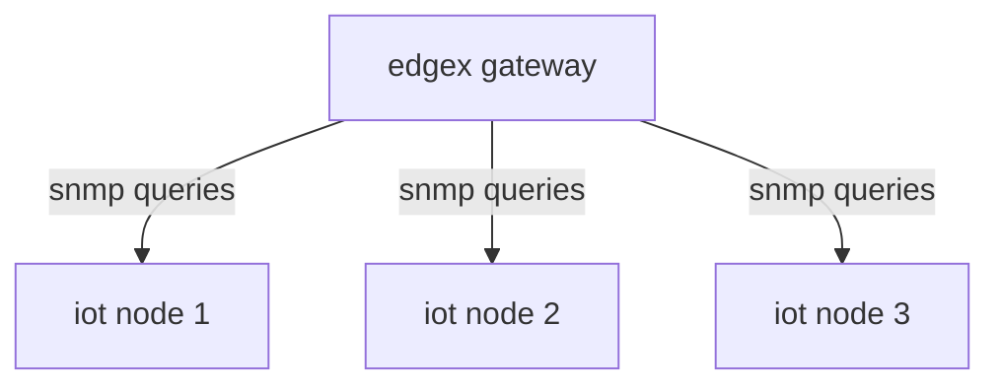

# EDGEX IOT SIMULATION

edgex cluster simulation with snmp devices as linux servers

## ARCHITECTURE

The idea is to simulate a network environment with a node acting as a edgex gateway pulling information (*uptime in this example*) from snmp capable iot nodes 



## INSTALLATION

- install vagrant and virtualbox

- create python venv and install dependencies

```bash
cd edgex_iot_simulation
python -m venv env 
source env/bin/activate
pip install -r requirements.txt
```

- install geerlingguy.docker role

```bash
source env/bin/activate
ansible-galaxy role install geeringguy.docker
```

- start cluster

```bash
vagrant up
```

- provision the cluster

```bash
ansible-playbook -i inventory.yaml playbook.yaml
```
