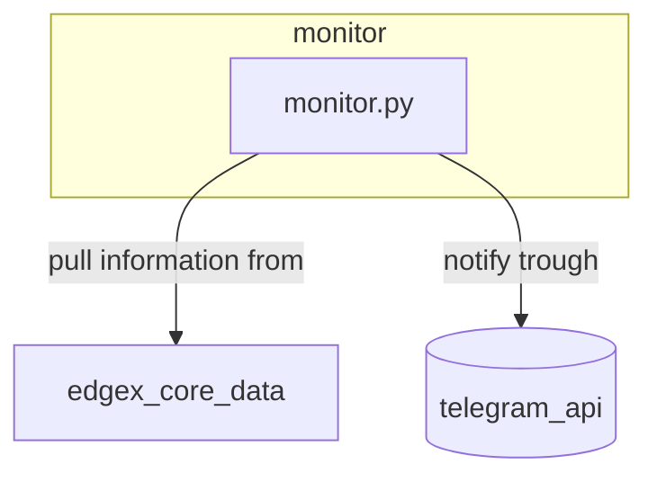

# Edgex IOT simulation

[edgex](https://www.edgexfoundry.org/) cluster simulation with snmp devices as linux servers

## Architecture

The idea is to simulate a network environment with a node acting as a [edgex](https://www.edgexfoundry.org/) gateway pulling information (*uptime in this example*) from snmp capable IOT nodes, the uptime data stream is used by a external developed application (*monitor*) that uses the information to notify that a node has been rebooted trough telegram messages


## Installation

- install [vagrant](https://www.vagrantup.com/) and [virtualbox](https://www.virtualbox.org/)

- create python virtual environment and install dependencies

```bash
cd edgex_iot_simulation
python -m venv env
source env/bin/activate
pip install -r requirements.txt
```

- install required ansible roles

```bash
source env/bin/activate
ansible-galaxy role install -r roles/requirements.yml
```

- start cluster

```bash
vagrant up
```

- run the `preflight.yml` playbook

```bash
ansible-playbook -i inventory.yml preflight.yml -e 'telegram_token=<INSERT_TOKEN>' -e 'telegram_channel_id=<INSERT_CHANNEL_ID>'
```

- in order to test the application simply restart the IOT node

```bash
vagrant reload iot-node-1
```

- and then inspect logs on the edgex-runtime node

```bash
cd /usr/local/edgex-runtime
docker compose logs monitor
```

## Results


### Preflight

in order to run the playbook telegram configuration parameter are neded to start the monitoring application

telegram_token: token of the bot given from [botfather](https://telegram.me/BotFather)
telegram_channel_id: channel_id where to route reboot notification from the monitor app, this can be obtained by

-  sending a message to the bot
-  connecting to the url `https://api.telegram.org/bot<bot-token>/getUpdates`

the API will reply with a json with the chat id information


### Monitor

Monitor application is a simple python script that fetches the data from the edgex-core microservice and send a telegram message to the configured channel id,
it's deployed exploiting the edgex compose file


